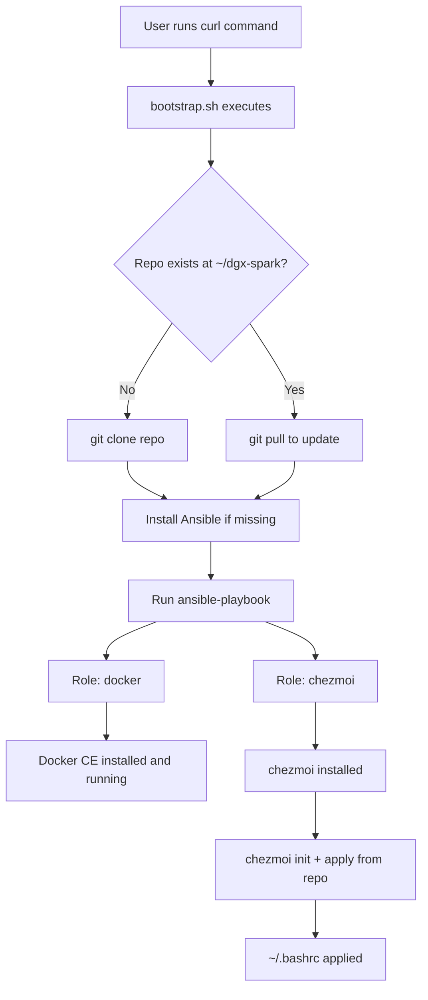

# DGX Spark — GitOps Configuration Plan

## Design Decisions

| Decision | Choice | Rationale |
|---|---|---|
| Repo URL | `https://github.com/michaelckearney/dgx-spark` | Public repo, curl-accessible |
| Clone location | `~/dgx-spark` | User-local, no sudo needed for clone |
| Target user | Parameterized via Ansible variable | Flexible across machines |
| Shell | bash (default) | Keep it simple for now |
| System packages | Docker only | Minimal starting point |
| Dotfiles | `~/.bashrc` only | Expand later as needed |
| Secrets | Deferred | Not needed yet |

---

## Repository Structure

```
dgx-spark/
├── README.md
├── bootstrap/
│   └── bootstrap.sh              # Single entrypoint script
├── ansible/
│   ├── inventory.ini             # localhost inventory
│   ├── playbook.yml              # Main playbook
│   ├── group_vars/
│   │   └── all.yml               # Shared variables (target_user, repo path, etc.)
│   └── roles/
│       ├── docker/
│       │   └── tasks/
│       │       └── main.yml      # Install Docker CE via official repo
│       └── chezmoi/
│           └── tasks/
│               └── main.yml      # Install chezmoi + apply dotfiles
├── chezmoi/
│   └── dot_bashrc                # chezmoi-managed ~/.bashrc
├── docs/
│   └── setup.md                  # Bootstrap and recovery instructions
└── scripts/                      # Helper scripts (empty for now)
```

---

## Execution Flow



---

## Component Details

### 1. bootstrap/bootstrap.sh

**Responsibilities:**
- Clone or update the repo to `~/dgx-spark`
- Install Ansible via `apt` if not present (requires sudo)
- Run `ansible-playbook` against localhost

**Key design points:**
- Uses `set -euo pipefail` for safety
- Idempotent: safe to re-run
- Minimal logic — delegates everything to Ansible
- The repo path and URL are the only hardcoded values

**Invocation:**
```bash
curl -fsSL https://raw.githubusercontent.com/michaelckearney/dgx-spark/main/bootstrap/bootstrap.sh | bash
```

---

### 2. Ansible Layer

#### ansible/inventory.ini
```ini
[local]
localhost ansible_connection=local
```

#### ansible/group_vars/all.yml
Parameterized variables:
- `target_user`: the user to configure (defaults to the user running the playbook)
- `target_home`: home directory (derived from target_user)
- `repo_dir`: path to the cloned repo
- `chezmoi_source`: path to chezmoi source dir within the repo

#### ansible/playbook.yml
- Targets `local` group
- Runs with `become: true` where needed
- Includes roles: `docker`, `chezmoi`

#### Role: docker
- Adds Docker official GPG key and apt repository
- Installs `docker-ce`, `docker-ce-cli`, `containerd.io`, `docker-compose-plugin`
- Ensures Docker service is enabled and started
- Adds `target_user` to the `docker` group

#### Role: chezmoi
- Installs chezmoi binary (via official install script or apt)
- Runs `chezmoi init` pointing at the repo's `chezmoi/` directory
- Runs `chezmoi apply` to deploy dotfiles
- Runs as `target_user` (not root)

---

### 3. chezmoi Layer

#### chezmoi/dot_bashrc
- A straightforward `.bashrc` file
- chezmoi naming convention: `dot_bashrc` → `~/.bashrc`
- Starts with sensible defaults (prompt, aliases, PATH additions)
- Can be expanded to a template later if needed

#### chezmoi configuration
- chezmoi will be initialized with `--source` pointing to the repo's `chezmoi/` directory
- This avoids a separate chezmoi repo — everything lives in this single repo

---

### 4. Documentation

#### docs/setup.md
- Prerequisites (git, curl, sudo, python3)
- The one-liner bootstrap command
- What happens during bootstrap
- How to re-run to reconcile drift
- How to add new packages or dotfiles

---

## What This Does NOT Include (Yet)

- No secrets management (deferred)
- No editor configs (deferred)
- No zsh/starship/fancy shell (deferred)
- No SSH config (deferred)
- No git config (deferred)
- No helper scripts (deferred)
- No CI/CD or automated testing (deferred)

These can all be added incrementally by adding new Ansible roles or chezmoi files.

---

## Files to Create

| # | File | Description |
|---|---|---|
| 1 | `bootstrap/bootstrap.sh` | Bootstrap entrypoint script |
| 2 | `ansible/inventory.ini` | Localhost inventory |
| 3 | `ansible/group_vars/all.yml` | Shared Ansible variables |
| 4 | `ansible/playbook.yml` | Main Ansible playbook |
| 5 | `ansible/roles/docker/tasks/main.yml` | Docker installation role |
| 6 | `ansible/roles/chezmoi/tasks/main.yml` | chezmoi installation and apply role |
| 7 | `chezmoi/dot_bashrc` | Managed bashrc dotfile |
| 8 | `docs/setup.md` | Setup and usage documentation |
| 9 | `README.md` | Project overview (update existing) |
