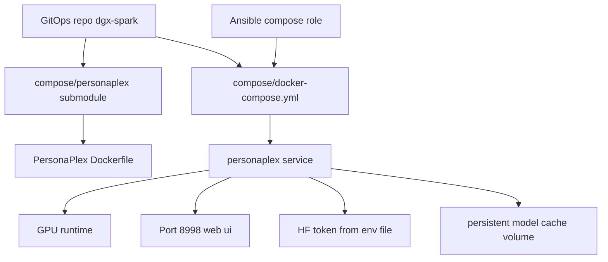

# PersonaPlex on DGX Spark - Compose Integration Plan

## Objective

Integrate NVIDIA PersonaPlex into the existing local stack defined in `compose/docker-compose.yml` using a git submodule at `compose/personaplex`.

## Current Findings

- Upstream PersonaPlex includes:
  - `docker-compose.yaml` with GPU reservation and cache volume
  - `Dockerfile` based on CUDA runtime image with Python 3.12 venv via `uv`
  - server command exposing port `8998`
  - support for `NO_TORCH_COMPILE=1`
  - Hugging Face token requirement for model download/license-gated weights
- Current repo compose stack already runs services on ports `3000`, `6333`, `6334`, and `11434`.
- Existing automation applies compose via Ansible role `ansible/roles/compose/tasks/main.yml`.

## Options

### Option A - Directly include PersonaPlex service in existing `compose/docker-compose.yml`

- Add `personaplex` service to existing stack
- Build context points to `compose/personaplex`
- Keep single project and single `docker compose up -d`

Pros:
- simplest operator workflow
- aligns with current GitOps reconcile behavior

Cons:
- larger stack reconciliation surface
- PersonaPlex restarts tied to shared compose deploy actions

### Option B - Separate compose file in `compose/personaplex-compose.yml`

- Keep PersonaPlex isolated but managed from same repo
- Ansible role can run two compose commands

Pros:
- better blast-radius isolation

Cons:
- more orchestration complexity
- diverges from your selected target `compose/docker-compose.yml`

### Option C - Profile-based inclusion in `compose/docker-compose.yml`

- Add PersonaPlex under profile `voice`
- start only when needed with profile flag

Pros:
- controlled resource usage

Cons:
- extra operator flags
- slightly more complexity than always-on service

## Recommended Path

Use Option A with a git submodule at `compose/personaplex`.

This matches your requested integration point and existing automation model while preserving upstream source traceability.

## Prerequisite Checklist

1. NVIDIA driver and runtime available on host
2. Docker engine and compose plugin working
3. GPU access from containers functional
4. PersonaPlex model license accepted on Hugging Face
5. `HF_TOKEN` available to compose runtime via env file
6. Port `8998` reachable from intended client network
7. Sufficient GPU memory or planned fallback with `--cpu-offload`

## Proposed Target Architecture

## Implementation Runbook Draft

1. Add git submodule at `compose/personaplex` pointing to upstream PersonaPlex repo
2. Add `personaplex` service to `compose/docker-compose.yml`
3. Configure service with:
   - build context `./personaplex`
   - mapped port `8998:8998`
   - GPU access configuration compatible with local compose runtime
   - cache volume mount for model artifacts
   - environment variable `NO_TORCH_COMPILE=1`
   - env file reference for `HF_TOKEN`
4. Add compose env template/documentation for required `HF_TOKEN`
5. Validate compose config rendering
6. Start stack and verify container health/logs
7. Open PersonaPlex UI endpoint and confirm model load
8. Document fallback path for memory pressure using cpu offload strategy

## Validation Plan

- `docker compose config` succeeds
- `docker compose up -d` creates `personaplex`
- container sees GPU and starts server without crash loop
- initial model pull succeeds with provided token
- endpoint accessible at `https://<host>:8998`

## Troubleshooting Plan

- auth failures: verify Hugging Face license acceptance and token scope
- GPU visibility errors: verify NVIDIA container runtime and compose GPU config
- OOM: add cpu offload mode or reduce concurrent workloads
- TLS/browser warnings: expected with temporary certs

## Follow-on Automation Opportunities

- add optional Ansible task guard to skip PersonaPlex startup until token exists
- add compose profile for on-demand start
- pin submodule commit for reproducible upgrades

